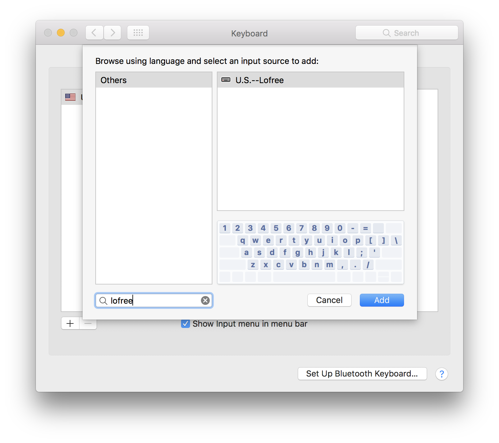

# Lofree Mechanical Keyboard Layout for Mac OS X
If you own a lofree Mechanical Keyboard, you’re aware of the fact that the numeric and the function rows have been shifted to the right by 1 key. This keyboard layout shifts the numeric row back to its original position, but leaves the function keys alone.

This keyboard layout was created using the [Summer Institute of Linguistics’ Ukelele Keyboard Layout Editor](http://scripts.sil.org/cms/scripts/page.php?site_id=nrsi&id=ukelele).

## Installation
1. Copy the file `Lofree.keylayout` to `~/Library/Keyboard Layouts`:

2. Open `System Preferences` → `Keyboard`, then choose the `Input Sources` tab. Make sure `Show Input menu in menu bar` is checked.

3. Click the `+` icon along the left column:

4. Search for “lofree” in the `Search` field. Along the right column, `U.S.--Lofree` should appear. Click on it then click the `Add` button on the bottom.

5. `U.S.--Lofree` should now appear along the left column:

6. You’ll have an icon in the menu bar, to the left of the clock, that you can now click to toggle input sources. Choose `U.S.--Lofree`

**Notes**: Toggling between windows is done with `ctrl` + `command` + `1`, and, the key with the backtick and the tilde is now in the slot to the left of the `delete` key. It acts as a placeholder in this layout, because that key is now mapped to a dead key.

## Verified On…
* Mac OS 10.11.x
* Mac OS 10.12.x
